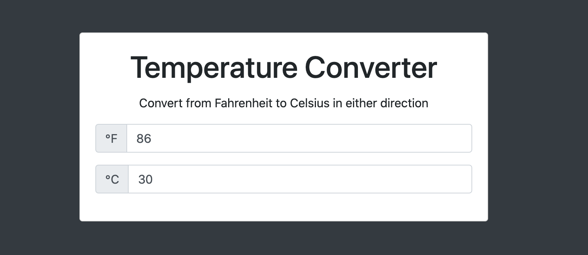

# _Temperature Converter_

#### This project is a browser-based temperature converter that converts from Fahrenheit to Celsius in either direction.

#### _06/2021_

#### By _**Chris Korsak**_

## Description

This temperature converter application converts from Fahrenheit to Celsius and from Celsius to Fahrenheit.

This application uses a CSS framework called [Bootstrap](https://getbootstrap.com/) to create the user interface. This application is fully responsive to all screen sizes.

## Setup/Installation Requirements

None. This is a web-based application hosted on Github pages. Check out the app [here!](https://chriskorsak.github.io/temperature-converter/)

## Technologies Used

* HTML
* CSS (Bootstrap framework)
* Javascript

## License

Copyright (c) 2021 Chris Korsak, all rights reserved.
  

